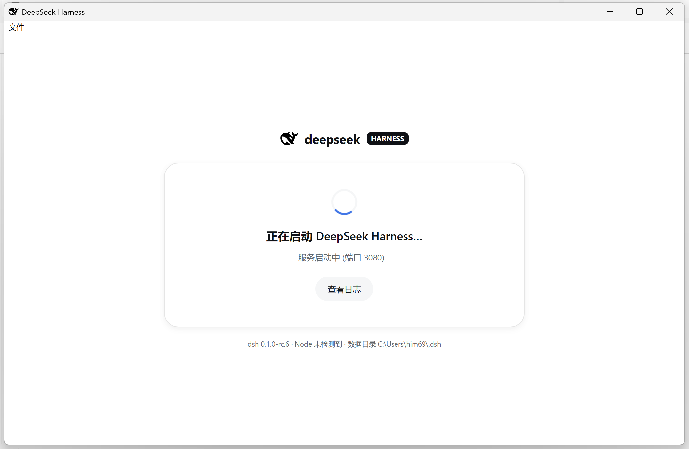
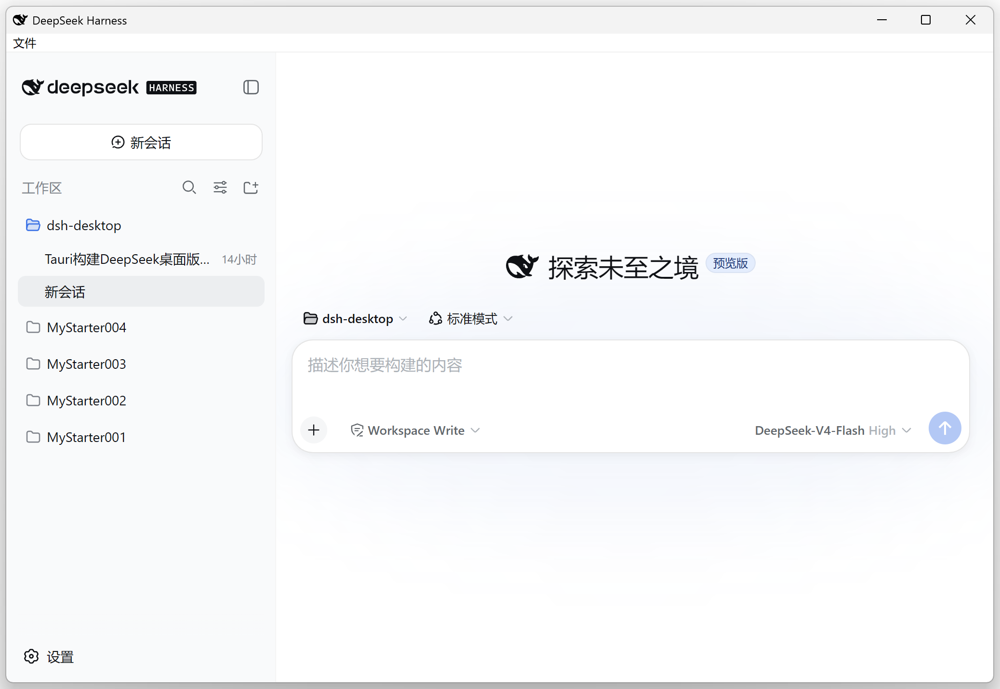

# Deepseek Harness Desktop (Tauri)

中文 | [English](README.en.md)

[](./LICENSE)
[](https://github.com/xiincs/deepseek-harness-desktop/releases/latest)
[](#)
[](https://v2.tauri.app/)

[DeepSeek Harness](https://github.com/deepseek-ai/deepseek-harness) 的 Windows 原生桌面版，基于
[Tauri 2](https://v2.tauri.app/) 构建。

它把 harness 自带的 Web 服务（`dsh web`）装进原生窗口：应用会自动拉起本地 `dsh` 服务进程，等它就绪后
把内置的 WebView2 指向它——界面和数据都跟浏览器版完全一致（打开 `http://127.0.0.1:3080` 看到的同一个
UI，`~/.dsh` 下的同一份数据），只是不用再开浏览器标签页。

<p align="center">
  
  &nbsp;&nbsp;
  
</p>

## 特性

- **一键启动**：自动拉起 `dsh` Web 服务并加载界面，无需手动操作。
- **数据共享**：会话、存储、配置都在 `~/.dsh`（`$DSH_HOME`），与浏览器版完全一致。
- **智能端口处理**：如果 `127.0.0.1:3080` 上已经有 `dsh` 服务在跑，直接挂接上去，不会重复起一个实例；
  如果端口被别的程序占用，自动改用系统分配的端口。
- **原生菜单与托盘**：托盘图标左键直接打开窗口，右键弹出菜单（在默认浏览器中打开、重启服务、打开数据
  目录、退出）。
- **托盘常驻**：关闭窗口只是隐藏，服务继续在后台跑；只有菜单/托盘里的"退出"才会真正停止服务并退出。
- **不再有黑框一闪而过**：每一个拉起的子进程（`dsh` 服务本身、首次运行时的 `npm install`）都抑制了
  控制台窗口，屏幕上只看得到应用窗口本身。
- **崩溃自动恢复**：服务意外退出会自动重启一次，仍然失败则显示带日志的重试页面。
- **自动更新**：启动页会在打开时检查是否有新版本，并提供一键安装。
- **攻击面最小化**：harness 页面作为纯远程页面加载，**不**授予任何 Tauri IPC 访问权限。

## 开发环境要求

- [Rust](https://rustup.rs/)（MSVC 工具链）——用于构建 Tauri 外壳
- [Node.js](https://nodejs.org/) >= 22——`dsh` 本身依赖（应用会从 `PATH` 里定位它）
- [WebView2 运行时](https://developer.microsoft.com/microsoft-edge/webview2/)（Windows 11 已预装，
  多数 Windows 10 也已预装）

## 开发

```bash
npm install          # 安装 @tauri-apps/cli
npm run tauri dev    # 编译 Rust 外壳并打开应用窗口
```

首次启动时，应用会把 `@deepseek-ai/dsh` 这个 npm 包安装到每用户独立的运行时目录
（`%LOCALAPPDATA%\dev.dsh.desktop\runtime`）并启动它。安装结果会被 npm 缓存，所以第二次启动会很快，
且不需要联网。

### 环境变量覆盖项

| 变量 | 作用 |
|---|---|
| `DSH_DESKTOP_NODE` | 指定 `node.exe` 的绝对路径，代替 `PATH` 上那个 |
| `DSH_DESKTOP_DSH_BIN` | 指定某个 `dsh` `lib/bin.js` 的绝对路径（比如本地某个 checkout） |
| `DSH_DESKTOP_RUNTIME_DIR` | 托管的 `@deepseek-ai/dsh` 运行时安装位置（默认是应用缓存目录）；指向一个已有的 `node_modules` 根目录可以跳过首次的 npm install |
| `DSH_DESKTOP_DSH_VERSION` | 托管运行时使用的 npm 版本号（默认 `0.1.0-rc.6`） |
| `DSH_DESKTOP_PORT` | 默认绑定端口覆盖（默认 `3080`）；同时跑多个实例时很有用 |
| `DSH_DESKTOP_CWD` | `dsh` 服务进程的工作目录（默认是用户主目录） |
| `DSH_HOME` | 透传给服务端；harness 数据根目录（默认 `~/.dsh`） |

## 架构

```
┌─ Tauri 应用 (Rust, WebView2) ─────────────────────────────┐
│ 本地启动页（加载中 / 出错 / 重试）                          │
│   └─ 就绪后跳转到 → http://127.0.0.1:<port>（真正的界面）  │
│ 服务管理器 (src-tauri/src/server.rs)                       │
│   定位 node → 安装/校验 dsh 运行时 → 探测 3080 端口         │
│   → 拉起 `node dsh web --port …` → 从 stdout 解析真实 URL   │
│   → 跳转 → 监视进程 → 退出时 taskkill 整棵进程树             │
│ 原生菜单与托盘 (src-tauri/src/menu.rs)                      │
└─────────────────────────┬────────────────────────────────┘
                          │ 拉起
                 ┌────────▼────────┐
                 │  dsh web 服务    │  数据 → ~/.dsh (DSH_HOME)
                 └─────────────────┘
```

harness 页面从 `http://127.0.0.1:<port>` 加载，故意**不**授予 Tauri IPC 访问权限
（`dangerousRemoteDomainIpcAccess` 始终不开启），所以 Web 界面本身接触不到桌面外壳——所有外壳层面的
操作都得走原生菜单/托盘，或者本地启动页。

## 路线图

- [x] 骨架代码、服务管理器、菜单/托盘、崩溃恢复
- [x] 持久化日志文件（`%LOCALAPPDATA%\dev.dsh.desktop\logs\desktop.log`）+ 启动页实时日志
- [x] 内置运行时：`npm run bundle` 会把 `node.exe`（选 Node 24——harness 自己的 `engines.node` 要求是
      `^22.19.0 || >=24.0.0`，Node 23 被上游有意排除在外，因为它是非 LTS/已 EOL 的分支）连同 `dsh`
      的 node_modules 一起打进 NSIS 安装包，这样没装 Node.js 的机器也能直接跑
- [x] 托盘常驻模式：关闭窗口只是隐藏，服务继续跑；每次运行首次关闭时会有一条通知说明这一点。只有
      菜单/托盘里的"退出"操作会真正停止服务并退出
- [x] 自动更新（`tauri-plugin-updater`）：启动页在启动时检查更新，并展示一条可关闭的横幅提示；
      `.github/workflows/release.yml` 在每次推送 `v*` tag 时构建、签名并创建一个 GitHub 草稿 Release
      （仍需人工点击发布——自动更新一旦出问题影响的是所有已装用户，所以不会有任何东西未经确认就自动
      上线）。内置 `dsh` 运行时版本与这个机制的关系见下文的"两条独立的版本轴线"
- [ ] macOS 版本——已经开了个头：`src-tauri/src/server.rs` 里 Windows 专属的那部分逻辑
      （`node.exe`/`taskkill`/`cmd /C npm`）现在收进了一个 `platform` 分区，也写了非 Windows 分支，
      但这些分支**还没有实测过**（没有 Mac 硬件和 CI 可用），`tauri.conf.json` 的 `bundle.targets`
      目前也还只支持 Windows（`["nsis"]`，macOS 需要加 `dmg`/`app` 配置——因为没法验证所以还没加），
      `scripts/fetch-node.mjs` 也还只会下载 Windows 版的 Node 二进制。如果你在真实 Mac 硬件上接手这
      部分：建议先用 `npm run tauri dev` 跑一个不打包的开发版，把 `server.rs` 里的 Unix 分支跑通再说

## 打包安装程序

```bash
npm install
npm run bundle        # fetch:node → prepare:runtime → tauri build
# 或者分步执行：
npm run fetch:node    # 下载 node.exe → src-tauri/resources/runtime
DSH_RUNTIME_SOURCE=<node_modules 根目录> npm run prepare:runtime  # 用本地运行时代替 npm install
npm run build         # → src-tauri/target/release/bundle/nsis/DeepSeek Harness_0.3.0_x64-setup.exe
```

正式发布前先跑一下 `npm run check:dsh-version`——上游还在开发者预览阶段，会毫无预警地发布新的 RC；
这个脚本会检查写死的 `@deepseek-ai/dsh` 默认版本号（在 `src-tauri/src/server.rs` 和
`scripts/prepare-runtime.mjs` 里各存了一份，两边必须一致）是否落后于 npm 上的最新版本。发布 CI
workflow 也会跑同一个检查，版本号对不上会直接让构建失败。

### 两条独立的版本轴线

这个应用有两个互相独立、不能混为一谈的版本号：

- **外壳版本**（`tauri.conf.json` 里的 `version`，比如 `0.3.0`）——桌面外壳本身的版本。
  `tauri-plugin-updater` 只会更新这一个。
- **运行时版本**（`server.rs` 里的 `DSH_VERSION_DEFAULT` / `prepare-runtime.mjs` 里的默认值，比如
  `0.1.0-rc.6`）——打进安装包或首次运行时安装的那个 `@deepseek-ai/dsh` 版本。

**对于内置运行时的安装方式（默认，即 `npm run bundle` 打出来的包）**，这两者会自动同步：NSIS 安装包
的内容里包含 `resources/runtime/`，所以外壳的自动更新会连带把构建时打进去的那个运行时版本一起重装
——只要在每次切外壳版本发布前把 `DSH_VERSION_DEFAULT` 更新好（并且 `check:dsh-version` 检查通过），
就不需要另外再搭一套运行时更新机制。

**对于托管（非内置）运行时的路径**——也就是没有 `resources/runtime/` 的场景（比如未打包的开发版，
或者 `DSH_DESKTOP_RUNTIME_DIR` 指向了别处）——运行时只会在首次使用时通过 `npm install` 装一次
（见 [server.rs](src-tauri/src/server.rs) 里的 `install_runtime`），**之后不会再检查**。走这条路径
的用户如果想用更新的 `dsh`，得自己清空 `DSH_DESKTOP_RUNTIME_DIR`（或者把 `DSH_DESKTOP_DSH_VERSION`
设成更新的版本号）让它重装。这是一个已知但影响面很窄的缺口——这条路径主要在开发时用得到，不值得为它
单独搭一套更新机制。

## License

[MIT](./LICENSE)
